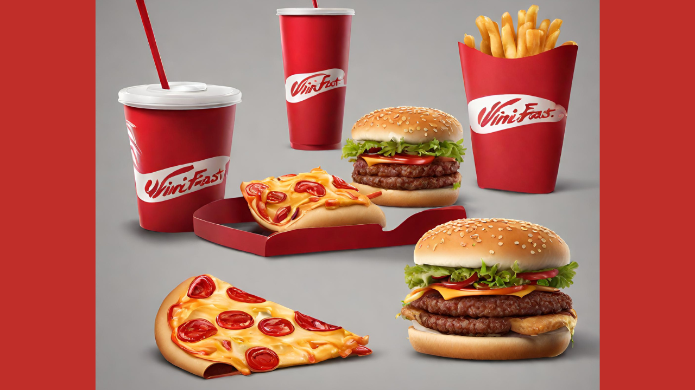

<h1 align="center">
Vini Fast Food  - Fullstack Challenge
</h1>
<h4 align="center">
Modelo de Fast food fullstack
</h4>

Faça seu pedido de forma rápida e com visualização em TEMPO REAL do que está sendo preparado na cozinha e também os pedidos para retirada!

 
 

[[Acesse o aplicativo online]](https://devio-frontend-git-devlopment-vinisi12363.vercel.app/)

 

### Principais recursos

- **Acesso rápido e fácil** - comece fazendo o seu pedido sem precisar de cadastros chatos, indicando apenas o nome para retirada e a forma e pagamento.
- **Organização** - Faça seus pedidos de forma simples, podendo alterar ou excluir qualquer item do pedido antes de finalizar, de acordo com o seu gosto.
- **Design responsivo** - Faça seus pedidos em qualquer dispositivo, seja no computador ou celular.
- **Design intuitivo** - Interface simples e intuitiva, com poucos cliques você consegue escolher os itens do pedido e finalizá-lo.
 

### Como ter acesso:

1. Acesse nosso site: **[FastFood]( https://devio-frontend-git-devlopment-vinisi12363.vercel.app/)**

 

### Como usar:
